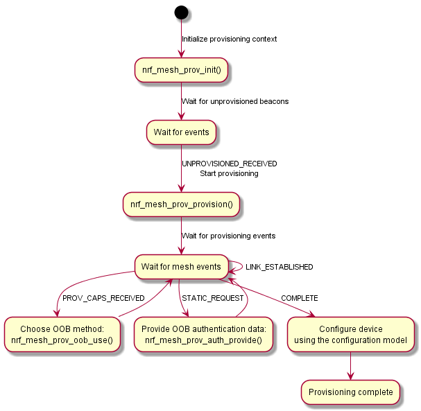
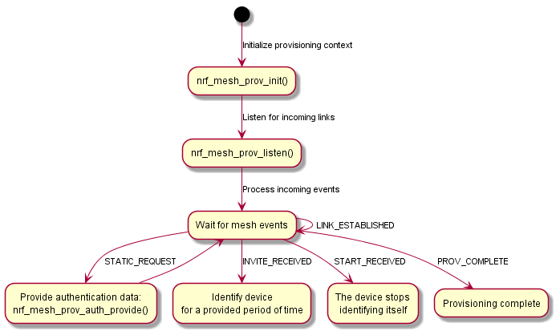

# Provisioning process and API

This page provides an overview of the provisioning procedure and the available API
functions for @ref provisioning_provisioners "setting up a provisioner"
and @ref provisioning_provisionee "setting up a provisionee".

**Table of contents**
- [Using provisioner APIs on the provisioner](@ref provisioning_provisioners)
    - [Setting up standalone provisioner](@ref provisioning_provisioners_standalone)
    - [Setting up serial provisioner](@ref provisioning_provisioners_serial)
        - [ECDH offloading](@ref provisioning_provisioners_serial_ecdh)
- [Using provisioning APIs on the provisionee (unprovisioned device)](@ref provisioning_provisionee)
- [Handing errors](@ref provisioning_handling-errors)

The following diagram illustrates the provisioning procedure, with all function
calls, messages, and events.

@note Before using the provisioning stack, the SoftDevice and mesh stack must
be initialized and enabled. As a reference, see `mesh_init()` in the `main.c` file of
the `light-switch\server` example or any other example exhibiting the Node role.

You can exclude code for one of the roles if your device
is not using it. To do so, link only the code for the role that you want the device to support.
Calling an unsupported function whose role functionality has not been compiled into the library
will return `NRF_ERROR_NOT_SUPPORTED`.

---

## Using provisioner APIs on the provisioner @anchor provisioning_provisioners

Provisioners are mesh nodes that are responsible for the configuration of other nodes
in the network. Typically, provisioners contain a configuration client and
client nodes for controlling specific functionality in other nodes, such
as lights or air conditioners. Provisioners are often a part of gateway devices,
which are devices that provide a bridge between a mesh network and other networking
technologies (such as the Internet).

There are two main ways of setting up a provisioner:
- running it as a standalone application ([standalone provisioners](@ref provisioning_provisioners_standalone)),
- having it controlled by a host application through a serial interface ([serial provisioners](@ref provisioning_provisioners_serial)).

The following figure illustrates the provisioner flow for both setups.

### Setting up standalone provisioner @anchor provisioning_provisioners_standalone

The standalone provisioner provides provisioning functionality without depending on
an external host. As such, a standalone provisioner must be able to store information about the
provisioned nodes in the network, including their addresses and device keys,
which is necessary for the provisioner to be able to configure the nodes.

Because of the limited amount of memory available in embedded processors, using
a standalone provisioner limits the amount of nodes that can be provisioned.
This limit corresponds to the maximum size of the mesh network.

To provision a device using the standalone provisioner, make sure you implement the following steps
in your provisioner application:

- [Step 1: Initialize a standalone provisioner](@ref provisioning_provisioners_standalone_init)
- [Step 2: Start the provisioning procedure](@ref provisioning_provisioners_standalone_start)
- [Step 3: Receive Provisioning Capabilities and select public key exchange and authentication method](@ref provisioning_provisioners_standalone_rx-select)
- [Step 4: Exchange public keys](@ref provisioning_provisioners_standalone_keys)
- [Step 5: Authenticate the provisioning procedure](@ref provisioning_provisioners_standalone_auth)
- [Step 6: Complete the provisioning procedure](@ref provisioning_provisioners_standalone_complete)

#### Step 1: Initialize a standalone provisioner @anchor provisioning_provisioners_standalone_init

To use any provisioning API, a provisioning context must be initialized using
the `nrf_mesh_prov_init()` function.

The function needs statically allocated provisioning context structure with related parameters.

The provisioning context structure maintains the state of the provisioning process.
Among other information, it contains the following data that is initialized based
on the parameter values provided by the user:
- Pointers to public and private keys -- a key pair used for encryption. These keys can be
  preprogrammed or generated using the `nrf_mesh_prov_generate_keys()` function.
    @note These numbers must be points on a specific elliptic curve, which
    means that regular random numbers cannot be used as a key pair.

The provisioning bearer should be initialized by calling the @ref nrf_mesh_prov_bearer_add() API.

See `prov_helper_provisioner_init()` in the static provisioner example
(`/examples/light-switch/provisioner/src/provisioner_helper.c`) to see how to initialize a provisioner.

#### Step 2: Starting the provisioning procedure @anchor provisioning_provisioners_standalone_start

The provisioning procedure is started by calling @ref nrf_mesh_prov_provision() API.

Make sure the following parameters are provided to this API:
- Pointer to the provisioning context.
- Pointer to the UUID of the node to be provisioned.
- Attention timer interval (in seconds).
- Pointer to the provisioning data.
    - This data contains information about netkey, netkey index, IV index, target address, IV update flag,
    and Key Refresh Flag to be provided to the unprovisioned device.
- Bearer to use.
    - Currently, the  mesh stack supports only @ref NRF_MESH_PROV_BEARER_ADV in provisioner role.

As a result, the provisioning modules:
-# Open the provisioning link with the device indicated by the UUID.
-# Send a Provisioning Invite message to invite the unprovisioned device to participate
in the provisioning process.

#### Step 3: Receiving Provisioning Capabilities and selecting public key exchange and authentication method @anchor provisioning_provisioners_standalone_rx-select

The unprovisioned device responds to the Provisioning Invite message by sending a Provisioning
Capabilities message. This action generates the @ref NRF_MESH_PROV_EVT_CAPS_RECEIVED event
for the provisioner application.

The provisioner application then checks the capabilities of the unprovisioned device reported in
the event parameters. It then calls the @ref nrf_mesh_prov_oob_use() function
to select the public key exchange mechanism and the authentication method.

After @ref NRF_MESH_PROV_EVT_CAPS_RECEIVED event is generated,
make sure you call the @ref nrf_mesh_prov_oob_use() function with the variables
and parameters that are used:
- Public key exchange mechanism.
    - If a public key of the unprovisioned device is available Out-of-Band (OOB), the provisioner
    application must set `capabilities.pubkey_type` to @ref NRF_MESH_PROV_OOB_PUBKEY_TYPE_OOB in
    the provisioning context. Otherwise, the application should not set this value.
- OOB authentication method.
    - Set the `method` parameter to one of the following:
        - For static OOB authentication: @ref NRF_MESH_PROV_OOB_METHOD_STATIC.
        - For output OOB authentication: @ref NRF_MESH_PROV_OOB_METHOD_OUTPUT.
        - For input OOB authentication: @ref NRF_MESH_PROV_OOB_METHOD_INPUT.
        - For no authentication: @ref NRF_MESH_PROV_OOB_METHOD_NONE.
    - Set the `action` parameter to one of the values mentioned in the `nrf_mesh_prov_types.h` file.
    - Set the `size` parameter to a value between `0x01` and `0x08` (as defined in @link_MeshSpec).

#### Step 4: Exchanging public keys @anchor provisioning_provisioners_standalone_keys

Exchanging public keys depends on whether you set `capabilities.pubkey_type` in Step 3:
- If `capabilities.pubkey_type` is set to @ref NRF_MESH_PROV_OOB_PUBKEY_TYPE_OOB in response to
@ref NRF_MESH_PROV_EVT_CAPS_RECEIVED event, the provisioning process will raise
@ref NRF_MESH_PROV_EVT_OOB_PUBKEY_REQUEST event for the provisioner application.
    - After receiving this event, provisioner application should fetch the Public Key
    of the provisionee (for example, ask user to type it in console if UART interface is available)
    and provide it to the stack using @ref nrf_mesh_prov_pubkey_provide() API.
- If `capabilities.pubkey_type` is not set, the public key will be exchanged In-Band
and no event will be generated.

#### Step 5: Authenticating the provisioning procedure @anchor provisioning_provisioners_standalone_auth

Depending on the authentication method choice in Step 3, the stack will generate different events:
-  For static OOB (@ref NRF_MESH_PROV_OOB_METHOD_STATIC): the mesh stack will generate
the @ref NRF_MESH_PROV_EVT_STATIC_REQUEST event.
    - After this event is received, the provisioner application should provide the static OOB value
    by calling @ref nrf_mesh_prov_auth_data_provide() API to continue the process.
- For output OOB (@ref NRF_MESH_PROV_OOB_METHOD_OUTPUT): the mesh stack will generate
@ref NRF_MESH_PROV_EVT_INPUT_REQUEST.
    - After this event is received, the provisioner application should request the input data from
    user and provide it by calling @ref nrf_mesh_prov_auth_data_provide() API to continue the process.
- For input OOB (@ref NRF_MESH_PROV_OOB_METHOD_INPUT): the mesh stack will generate
@ref NRF_MESH_PROV_EVT_OUTPUT_REQUEST and provide data as output to the application.
    - After this event is received, the application should use the provided data to carry
    out the output action.
- For no authentication (@ref NRF_MESH_PROV_OOB_METHOD_NONE): no events will be
generated during the provisioning process.

#### Step 6: Completing the provisioning procedure @anchor provisioning_provisioners_standalone_complete

If the authentication succeeds:
-# The stack will distribute the provisioning data to the unprovisioned device.
-# The unprovisioned device will then send a Provisioning Complete message
to indicate that it has received the data.
-# After receiving this message, the mesh stack will generate @ref NRF_MESH_PROV_EVT_COMPLETE event.
The provisioner application can then store the device key and address of the newly provisioned device.

After this step, the provisioning link will be closed and the @ref NRF_MESH_PROV_EVT_LINK_CLOSED
event will be generated.

### Setting up serial provisioner @anchor provisioning_provisioners_serial

Serial provisioners use the serial interface to do provisioning, allowing a host
controller to interact with the mesh network using an external microcontroller.

The host controller stores information about the nodes on the network, which saves RAM
in the external microcontroller for other application-specific uses.
The size of the mesh network is limited only by the resources available in the host machine.

The steps to include in your serial provisioner application are the following:
-# Initialize the SoftDevice and the mesh stack using the @ref md_doc_getting_started_how_to_run_examples "standard procedure".
-# Initialize and enable the serial interface using `nrf_mesh_serial_init()` and
   `nrf_mesh_serial_enable()` API functions.
-# [Enable the ECDH offloading](@ref provisioning_provisioners_serial_ecdh).
-# Provision a device with the same procedure as for @ref provisioning_provisioners_standalone "standalone provisioners",
but replace the standalone API calls with [serial commands](@ref md_doc_libraries_serial_cmd) and the standalone events with
[serial events](@ref md_doc_libraries_serial_evt).

#### ECDH offloading @anchor provisioning_provisioners_serial_ecdh

The ECDH (Elliptic Curve Diffie-Hellman) is a crytographic algorithm used to securely
create a shared secret between two devices. It is used to create an encryption key,
which is then used for securing the provisioning data as it is being transferred to
the provisionee.

Enable the ECDH offloading if you are running multiple provisioners in parallel.
The ECDH is a processor-intensive algorithm that can easily become a bottleneck.
The ECDH offloading is a feature that lets the host processor calculate the ECDH shared
secret, which saves CPU resources in the target processor.

To enable the ECDH offloading, make sure your application calls @ref mesh_opt_prov_ecdh_offloading_set
when initializing the device.

---

## Using provisioning APIs on the provisionee (unprovisioned device) @anchor provisioning_provisionee

Provisionee is a device that will be provisioned by the provisioner. After provisioning completes
successfully, this device becomes a node in the mesh network.

The following figure shows a sample flow chart of the provisioning process when the Static OOB
authentication is used.

To provision an unprovisioned device, make sure you implement the following steps
in your provisionee application:
- [Step 1: Initializing a provisionee](@ref provisioning_provisionee_initialization)
- [Step 2: Starting the provisioning procedure](@ref provisioning_provisionee_start)
- [Step 3: Sending Provisioning Capabilities and receiving Provisioning Start](@ref provisioning_provisionee_messages)
- [Step 4: Exchanging public keys](@ref provisioning_provisionee_keys)
- [Step 5: Authenticating the provisioning procedure](@ref provisioning_provisionee_auth)
- [Step 6: Completing the provisioning procedure](@ref provisioning_provisionee_complete)

### Step 1: Initializing a provisionee @anchor provisioning_provisionee_initialization

To use any provisioning API, a provisioning context must be initialized using
the `nrf_mesh_prov_init()` function.

The function needs statically-allocated provisioning context structure and other related parameters.

The provisioning context structure maintains the state of the provisioning process.
Among other information, it contains the following data that is initialized based
on the parameter values provided by the user:
- Pointers to public and private keys -- a key pair used for encryption. These keys can be
  preprogrammed or generated using the `nrf_mesh_prov_generate_keys()` function.
    - @note These numbers must be points on a specific elliptic curve, which
    means that regular random numbers cannot be used as a key pair.
- [Out-of-band (OOB) authentication capabilities](@ref nrf_mesh_prov_oob_caps_t) -- used to
  determine what kind of authentication can be used with the node.
    - The authentication method is selected by setting one or more values
    of the authentication-related fields (`oob_static_type`, `oob_output_size`, `oob_output_actions`,
    `oob_input_size`, and `oob_input_actions`):
        - For authentication using Static OOB: set [oob_static_types]
        (@ref nrf_mesh_prov_oob_caps_t::oob_static_types) to @ref NRF_MESH_PROV_OOB_STATIC_TYPE_SUPPORTED.
            - When this authentication method is supported, the provisionee application should
            provide Static OOB information when requested by the provisioner.
            - If Output OOB is not used, set the `oob_static_types` to `0`.
        - For authentication using Output OOB: set [oob_output_size]
        (@ref nrf_mesh_prov_oob_caps_t::oob_output_size) to a value between `0x01` to `0x08`
        and [oob_output_actions] (@ref nrf_mesh_prov_oob_caps_t::oob_output_actions) to a
        desired [output action](@ref nrf_mesh_prov_output_action_t).
            - When this authentication method is supported, the provisionee application should
            carry out [oob_output_actions] (@ref nrf_mesh_prov_oob_caps_t::oob_output_actions)
            as specified by the provisioner.
            - If Output OOB is not used, set the `oob_output_size` to `0x00`.
        - For authentication using Input OOB: set [oob_input_size]
        (@ref nrf_mesh_prov_oob_caps_t::oob_input_size) to a value between `0x01` to `0x08`
        and [oob_input_actions] (@ref nrf_mesh_prov_oob_caps_t::oob_input_actions) to a
        desired [output action](@ref nrf_mesh_prov_output_action_t).
            - When this authentication method is supported, the provisionee application should
            be ready to get the input OOB data from the user as requested by the provisioner.
            - If Input OOB is not used, set the `oob_input_size` to `0x00`.
        - For no authentication: set only the [algorithms](@ref nrf_mesh_prov_oob_caps_t::algorithms)
        field.

For regular mesh devices (the devices exhibiting the node role), the initialization of the
provisioning stack with bearers is encapsulated
by the @ref MESH_STACK within the @ref mesh_provisionee_prov_start() API.

The authentication options can be customized in @ref mesh_provisionee_prov_start() by updating
the `prov_caps` structure with desired values.

### Step 2: Starting the provisioning procedure @anchor provisioning_provisionee_start

The provisioning procedure is started by the provisioner, which opens a provisioning link
and sends a provisioning invite.

Before the provisioning link can be opened, the unprovisioned device must initialize
the provisioning APIs and bearers and it must be ready to receive the request to open the link.
For mesh example applications, this process is encapsulated in the @ref mesh_provisionee_prov_start()
API in the [mesh_provisionee.c](@ref MESH_PROVISIONEE) module and includes the following actions:
- Select the default values for public key exchange (In-Band).
- Select the authentication options (Static OOB).
- Call the @ref nrf_mesh_prov_init() API.
- Initialize bearers.
- Start advertising the unprovisioned node beacons by calling @ref nrf_mesh_prov_listen() API.
The advertisement can optionally include both of the following elements:
    - a URI that points to the location for additional data,
    - a field that specifies the location where the OOB information can be found.

To customize public key exchange and authentication options, you can modify the `prov_caps` structure
values in this API.

@note
Modifying `prov_caps` options here will change these options for all examples.
Alternatively, you can copy this module with some other name, update the `prov_caps` values,
and use this new module in your project.

Once the provisioner opens the link, the mesh stack generates @ref NRF_MESH_PROV_EVT_LINK_ESTABLISHED event.
When the [Provisioning Invite message](@ref provisioning_provisioners_standalone_start) is received,
the mesh stack generates the @ref NRF_MESH_PROV_EVT_INVITE_RECEIVED event and provides
the [attention timer duration](@ref nrf_mesh_prov_evt_invite_received_t::attention_duration_s)
value as the event parameter. This event is handled by the [mesh_provisionee.c](@ref MESH_PROVISIONEE) module
and the user application callback is called to allow the application to attract attention of the end-user.
For example, this can mean blinking LEDs for a given duration.

### Step 3: Sending Provisioning Capabilities and receiving Provisioning Start @anchor provisioning_provisionee_messages

The unprovisioned device will respond to the Provisioning Invite message by sending a Provisioning
Capabilities message (with settings specified in [Step 1](@ref provisioning_provisionee_initialization).
This will not generate any event for the provisionee application.

The provisioner picks up the public key exchange and the authentication method from the
provided capabilities and sends the Provisioning Start message. This generates
the @ref NRF_MESH_PROV_EVT_START_RECEIVED event on the provisionee side.

### Step 4: Exchanging public keys @anchor provisioning_provisionee_keys

Exchanging public keys depends on whether the provisionee sets `capabilities.pubkey_type`
to @ref NRF_MESH_PROV_OOB_PUBKEY_TYPE_OOB :
- If the the provisionee sets `capabilities.pubkey_type` to @ref NRF_MESH_PROV_OOB_PUBKEY_TYPE_OOB,
the provisioner:
    -# Reads the public key of the provisionee Out-of-Band (for example, from a text file,
    if the provisioner is a tablet or a computer).
    -# Sends its own public key.
- If the the provisionee does not set `capabilities.pubkey_type` to @ref NRF_MESH_PROV_OOB_PUBKEY_TYPE_OOB :
    - The provisionee stack will send its public key In-Band.

After this step, the authentication will be performed.

### Step 5: Authenticating the provisioning procedure @anchor provisioning_provisionee_auth

Depending on the available capabilities and [the authentication method chosen by the provisioner](@ref provisioning_provisioners_standalone_rx-select),
the mesh stack will generate different events:
- For static OOB authentication (@ref NRF_MESH_PROV_OOB_METHOD_STATIC): the mesh stack will generate
the @ref NRF_MESH_PROV_EVT_STATIC_REQUEST event.
    - After this event is received, the application should provide the static OOB value
    by calling @ref nrf_mesh_prov_auth_data_provide() API to continue the process.
    - @note The static OOB value is always 16-byte long.
- For output OOB authentication (@ref NRF_MESH_PROV_OOB_METHOD_OUTPUT): the mesh stack will generate
the @ref NRF_MESH_PROV_EVT_OUTPUT_REQUEST and provide data output to the application as
the event parameter.
    - The application should then use this output data to carry out the output action.
- For input OOB authentication (@ref NRF_MESH_PROV_OOB_METHOD_INPUT): the mesh stack will generate
the @ref NRF_MESH_PROV_EVT_INPUT_REQUEST event.
    - The provisioner application should then request the input data from the user and provide it
    by calling @ref nrf_mesh_prov_auth_data_provide() API to continue the process.
- For no authentication method (@ref NRF_MESH_PROV_OOB_METHOD_NONE): no events will be
generated during the authentication step.

### Step 6: Completing the provisioning procedure @anchor provisioning_provisionee_complete

If the authentication succeeds:
-# The stack receives the provisioning data from the provisioner.
-# The mesh stack generates the @ref NRF_MESH_PROV_EVT_COMPLETE event.
-# The mesh stack sends the Provisioning Complete message to indicate that it has received
the provisioning data.
-# If @ref PERSISTENT_STORAGE is enabled, upon receiving the @ref NRF_MESH_PROV_EVT_COMPLETE event,
the `mesh_provisionee` module saves the provisioning data to the flash.

After this step, the provisioning link will be closed and the @ref NRF_MESH_PROV_EVT_LINK_CLOSED
event will be generated.

At this point, the device can receive more configuration details from the provisioner through
the configuration model. The configuration happens automatically in the background as long as
the configuration model server has been initialized (see the @ref md_examples_light_switch_README
for an example of how to do this).

---

## Handing errors @anchor provisioning_handling-errors

If an error occurs in the provisioning procedure, the provisioning link is closed. An
`::NRF_MESH_PROV_EVT_LINK_CLOSED` event is passed to the application.
This event contains the `nrf_mesh_prov_evt_link_closed_t.close_reason` parameter that can be used
to determine what caused the provisioning to fail.

If an `::NRF_MESH_PROV_EVT_LINK_CLOSED` event is received before an `::NRF_MESH_PROV_EVT_COMPLETE`
event, the provisioning procedure must be considered to have failed.

Additionally, the peer device may send a Provisioning Failed PDU as a result of any error other than the timeout.
After receiving the Provisioning Failed PDU, the `::NRF_MESH_PROV_EVT_FAILED` event is passed to the application.
This event contains the [failure_code](@ref nrf_mesh_prov_evt_failed_t::failure_code) parameter
that can be used to determine what caused the Provisioning Failed event.

